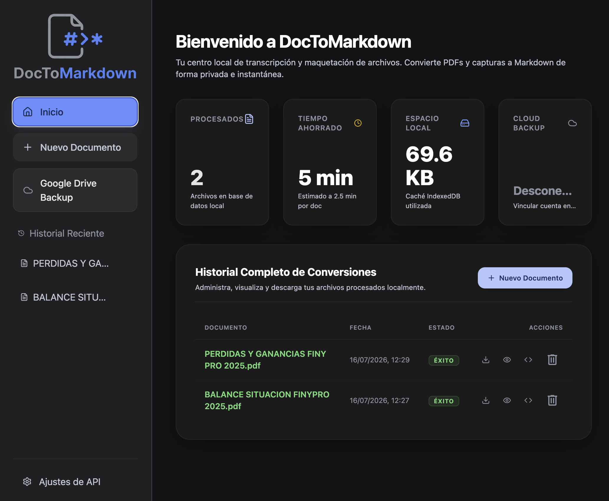
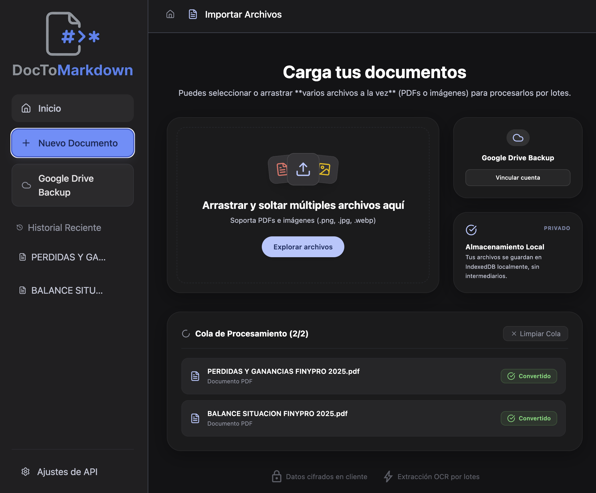
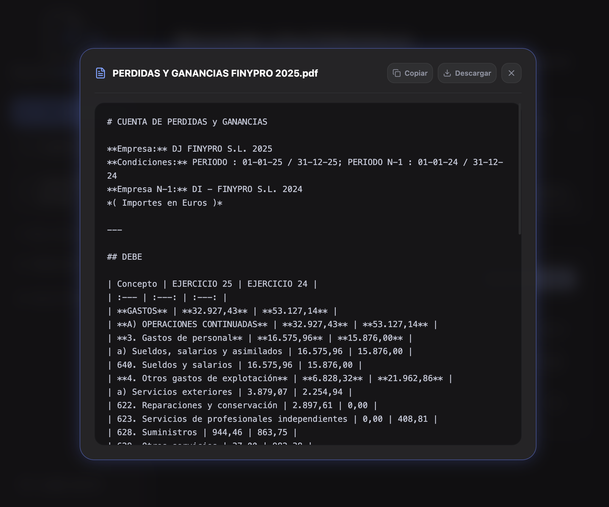

# DocToMarkdown (DocTomdAI) 📄➔✍️

**DocToMarkdown** es una aplicación web local-first de alto rendimiento diseñada para transcribir e interpretar de forma inteligente documentos PDF, presupuestos, balances contables y capturas de pantalla, maquetándolos automáticamente a formato **Markdown estricto** empleando los modelos de IA más avanzados de Google Gemini.

La aplicación prioriza la privacidad absoluta almacenando todos tus datos en local (IndexedDB) y permitiéndote sincronizar tus archivos mediante copias de seguridad manuales o automáticas en tu cuenta personal de **Google Drive**.

---

## 📸 Capturas de la Aplicación

### 1. Panel de Inicio (Dashboard) e Historial Completo


### 2. Carga y Cola de Procesamiento por Lotes


### 3. Editor de Workspace y Previsualización de Código


---

## ✨ Características Principales

*   **🤖 OCR Inteligente Autodetectable**: La aplicación consulta dinámicamente tu API key para detectar qué modelos tienes autorizados en Google AI Studio (priorizando `gemini-3.5-flash`, `gemini-3.1-flash-image`, `gemini-2.0-flash` o `gemini-1.5-flash`), garantizando compatibilidad total.
*   **📦 Procesamiento por Lotes (Batch Processing)**: Arrastra o selecciona múltiples PDFs o imágenes simultáneamente. La app procesará los archivos secuencialmente mostrando una barra de progreso individual y ticks de éxito o alertas rojas con detalles de fallos.
*   **💾 Almacenamiento Local-First**: Máxima privacidad. Tus archivos originales y el historial de conversión se guardan exclusivamente en el navegador mediante **IndexedDB (localForage)**. Ningún dato sensible pasa por servidores intermediarios.
*   **☁️ Copia de seguridad en Google Drive (Monocromo)**: Integra un sistema de copias de seguridad manual (Exportar/Importar) y sincronización automática tras cada conversión exitosa para que nunca pierdas tu historial.
*   **💎 Visor Flotante de Markdown Premium**: Caja flotante con efecto **vidrio translúcido (glassmorphism)** y un borde con **iluminación azul brillante (glowing effect)** para previsualizar el código Markdown plano (UTF-8), incluyendo un botón de copiado rápido al portapapeles y descarga directa del archivo `.md`.
*   **📱 Diseño Totalmente Responsivo**: Adaptación móvil completa que incluye barra de navegación inferior flotante, drawer lateral táctil para el historial y un editor por pestañas para alternar fácilmente entre la visualización del archivo de origen y el código markdown.

---

## 🛠️ Tecnologías Utilizadas

*   **React + TypeScript** (Estructura y lógica tipada fuerte)
*   **Vite** (Compilador y empaquetador ultrarrápido)
*   **TailwindCSS** (Estilos y transiciones premium)
*   **localForage** (IndexedDB optimizado en cliente para almacenamiento persistente)
*   **Google Gemini API** (Modelos de lenguaje multimodal para extracción y maquetación OCR)
*   **Google Drive API (OAuth 2.0)** (Sincronización en la nube en cliente)
*   **Lucide React** (Paquete de iconos minimalistas consistentes)

---

## 🚀 Instalación y Desarrollo Local

### Requisitos Previos

*   **Node.js**: Versión `>=22.12.0` (recomendada) o `>=20.19.0`.
*   Una **API Key de Gemini** (Obtenible de forma gratuita en [Google AI Studio](https://aistudio.google.com/)).
*   Un **Google Client ID** de OAuth 2.0 (Obtenible en la consola de Google Cloud para sincronización con Drive).

### Pasos para Configurar Localmente

1. **Clona el repositorio**:
    ```bash
    git clone https://github.com/manueladolfo/DocTomdAI.git
    cd DocTomdAI
    ```

2. **Instala las dependencias**:
    ```bash
    npm install
    ```

3. **Ejecuta el servidor de desarrollo**:
    ```bash
    npm run dev
    ```
    Abre tu navegador en `http://localhost:5173`.

4. **Compila para producción**:
    ```bash
    npm run build
    ```
    Esto generará la carpeta estática `dist/` optimizada para ser desplegada en plataformas como Vercel, Netlify o GitHub Pages.

---

## 🔒 Privacidad y Seguridad

Esta aplicación se ejecuta **100% en el lado del cliente (Client-Side)**.
*   Tus claves de API (Gemini y Google OAuth) se guardan localmente en el `localStorage` de tu navegador.
*   Tus datos de conversión e historial nunca se transfieren a bases de datos de terceros. Las únicas conexiones externas directas son hacia las APIs oficiales de Google (`generativelanguage.googleapis.com` y `googleapis.com/drive`).
